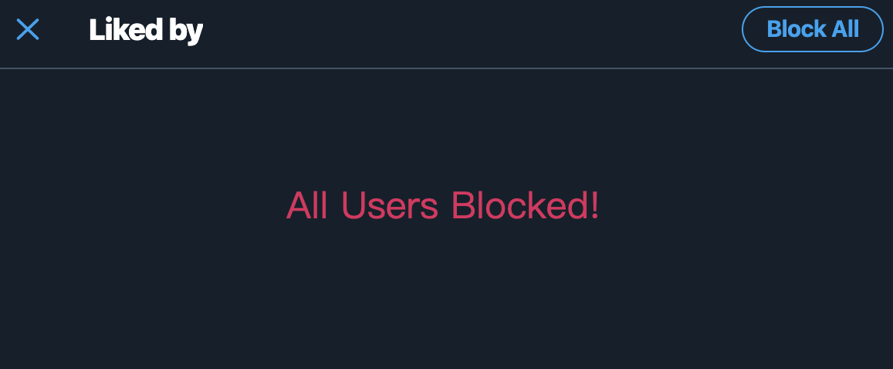

# Twitter-Block-With-Love
Block users who loves a specific tweet, and help you improve your experience using twitter.

## Install

Visit https://greasyfork.org/en/scripts/398540-twitter-block-with-love and install. You may also need to install a script manager like the Tampermonkey.

## Usage

1. Go to the "Liked by" page of a tweet which shows you the list of likers.

2. Click "Block ALL" button.

## Notice

- This script has not been tested for tweets that are liked by over 500 people.
- The block operation ***CANNOT BE UNDONE***. **Think twice** before blocking about whether you really need to block that group of users.

